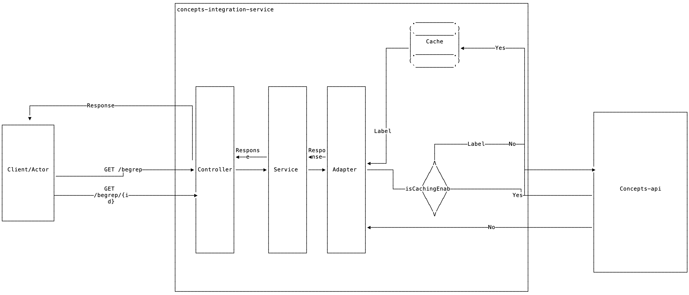

## concepts-integration-service

### Intro

For this project i chose to use Spring boot v3.3.3 as this is the latest stable release
for Spring boot, and is it one thing i want for my integration service. That it is reliable to run and to work with

Spring Boot is well known in the industry and a lot of java developers is familiar with this framework.
Therefore i can safely assume that when i am retired from the project, there will be developers that should be able
to further maintain the project without spending a lot of time for onboarding.

Also Spring boot makes it incredibly to scratch and have a running webserer running with little extra configuration.
Its ready to start building out of the box.

The project is compiled into Java 17 with openjdk - For no other reason that this is what i had installed locally.
It works like a charm!

### Building the project locally

* Make sure you have built this docker container
  locally: https://github.com/KnowitAmende/Oppgaver/blob/main/Backend/build_and_run.sh, and that it is available at
  http://localhost:8080
* This Spring boot app is using gradle as its build system. Open the project in intellij and let gradle download all
  spring dependencies.
* This Spring boot app is available at http://localhost:9090
* In intelliJ, go to the ConceptsIntegrationServiceApplication.kt - kotlin file and press the "play" sign to the left of
  the main function. That way the run config is available to us in intelliJ.
* Caching is on by default. If you want to test this app without caching. Go `AdapterConfig.kt` under the `conceptsApi`
  -package and set the value of `isCachingEnabled` to `false`.

### The project

The task that was given:

```
Kunden du jobber for ønsker at du skal utvikle en ny integrasjonstjeneste. Tjenesten skal tilgjengeliggjøre diverse begreper. Den skal erstatte en eldre eksisterende løsning og må derfor gi ut data på samme format. Tjenesten skal hente data fra en intern tjeneste som leverer data på et internt format.

I denne oppgaven skal du sett opp en REST-applikasjon som integreres mot en intern tjeneste.

Lag en integrasjonstjeneste som tilbyr informasjon om begreper. Begrepene skal hentes fra den interne tjenesten og tilbys som angitt under. Du kan selv velge teknologi og rammeverk, men gi gjerne en begrunnelse for valgene.

Tjenesten skal tilby følgende endepunkter:

/begrep
Endepunkt som leverer en liste med alle begreper

/begrep/{id}
Endepunkt som leverer ett begrep med angitt id.
```

The endpoints i have set up is located in the project at `concepts/Controller.kt`.
This class provides us with the endpoints `/begrep` and `/begrep/{id}`, which does what is intended given by the task.

### How i solved the project

Considerations: The provided service i am integrating against is slow. Therefore i made a local cache that lives and
dies with an instance of this service.

Since this is a simple usecase for a cache, i did not bother using redis or similar solutions, and since beans in spring
boot
are singletons, a local homerolled cache solution was a good enough solution.

**Pros:**

* This solution trades favours having a slow initial startup than just mirroring the slow performance into this service
  as well.
* Easy to maintain
* We dont spam the service with unnecessary trafic everytime we need concepts from this service. (what if the service i
  am integrating against charges us for a x amount of calls to their service?).
* Easier to test
* Blazingly fast compared to without a cache⚡️

**Cons:**

* The cache as it is today loses all of its state when the service is taken down, so this solutions favours long-lived
  instances
* Sending the requests with this integration service as a pure proxy is generally faster if it is not important how much
  traffic we send against the service.

The architecture i chose, was a well known one. Controller -> Service -> Adapter/Repository for either traffic against a
database or a third-party api, like it is in this case.

**Component diagram showing the architecture of the integration service:**



**Considerations for further development:**

Since this is an app i coded in 2 hours there is some weaknesses i know of but did not implement, but i am listing them
regardless:

* The resultset supports multiple locales (NB,NN and EN) This could be used to implement locale settings to support
  multiple locales
* The cache does not "hydrate" against the the api after it is initially loaded on startup with content .
    * A possible solution for this is to store amount of pages in the cache as well and compare it to the total amount
      of pages we get from the api. This way we can know if there is more concepts added to the api.
    * It should be possible for the api to once in a while (automated cron job) to query the api and
      compare `definitionLastUpdated` to update the cache when a concept is edited by the maintainers of the third party
      api.
* The app is missing tests. This should be added as to make the integration service less prone to errors while being
  maintained by developers.
* The concepts are not sorted in the api we are integrating against, so the concepts does not get sorted in the cache
  either.
* A smarter lookup algorithm when going directly against the api could be smarter. But since the concepts are not
  sorted, i did not spend time on planning this out
* Since the service initially knows how many pages there are of concepts it could be possible to println out the
  progress as percent instead of printing out the page numbers for each page stored in cache